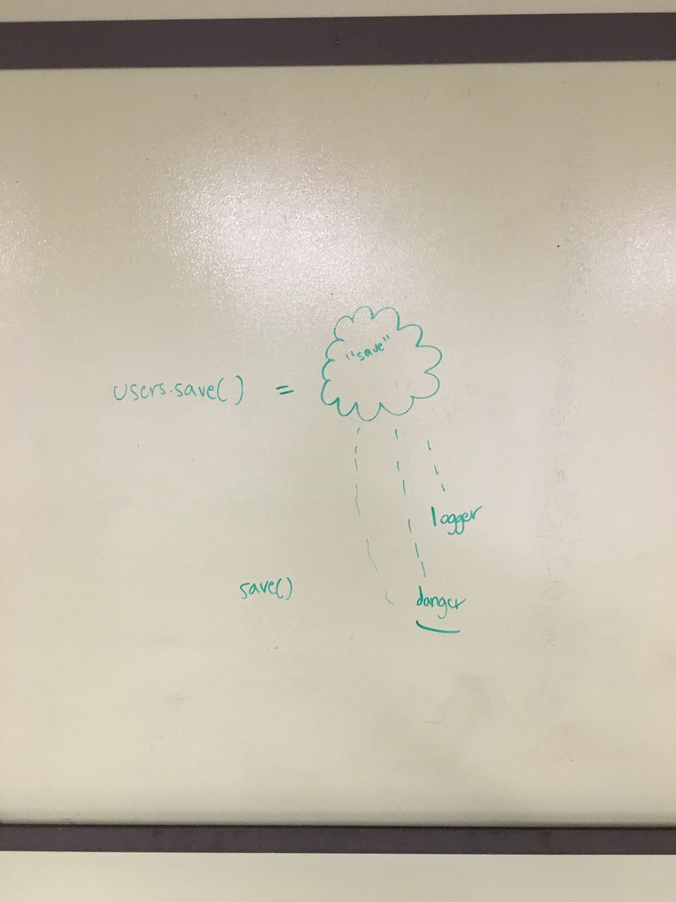

# lab-class-16

## Project Name
event driven “smart app”

### Author: Brad Smialek

### Links and Resources
* [submission PR](https://github.com/brad-smialek-401-advanced-javascript/lab-class-16/pull/1)
* [travis]()

#### Documentation

### Modules
#### `event.js`
#### `logger.js`

##### Exported Values and Methods

###### `foo(thing) -> string`
Usage Notes or examples

###### `bar(array) -> array`
Usage Notes or examples

#### Running the app
* `node app.js`
* Endpoint: `readFile`
  * Returns a JSON object with abc in it.
* Endpoint: `writeFile`
  * Returns a JSON object with xyz in it.
  
#### Tests
* npm test
* What assertions were made?
* What assertions need to be / should be made?

#### UML

